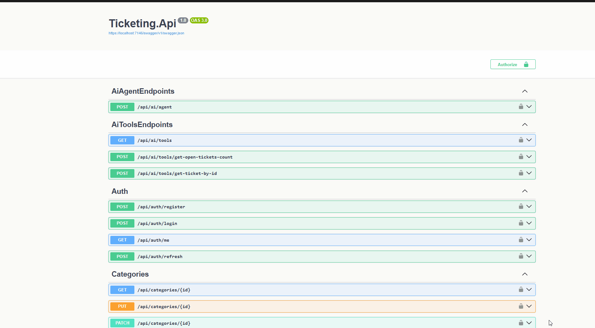
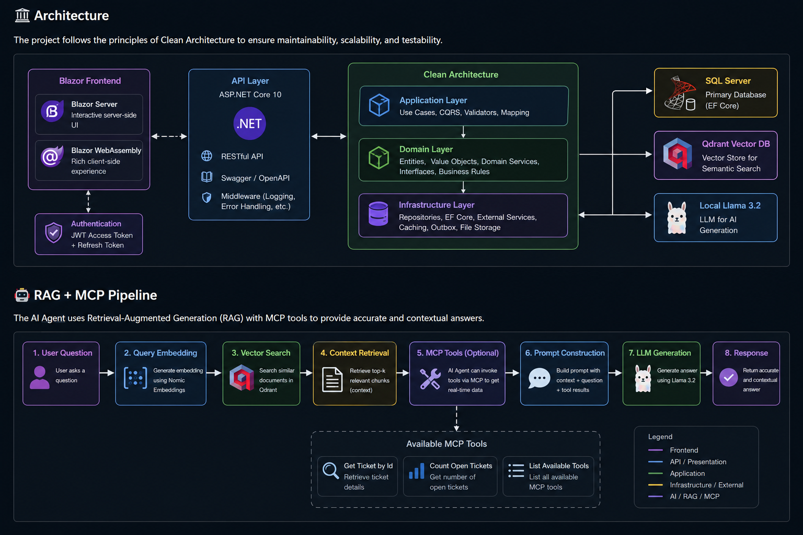
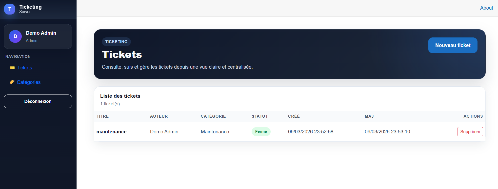
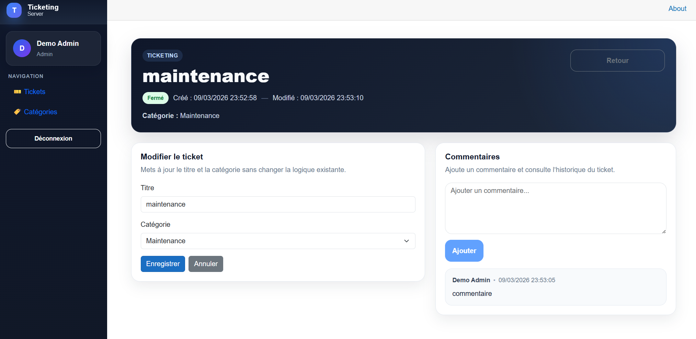
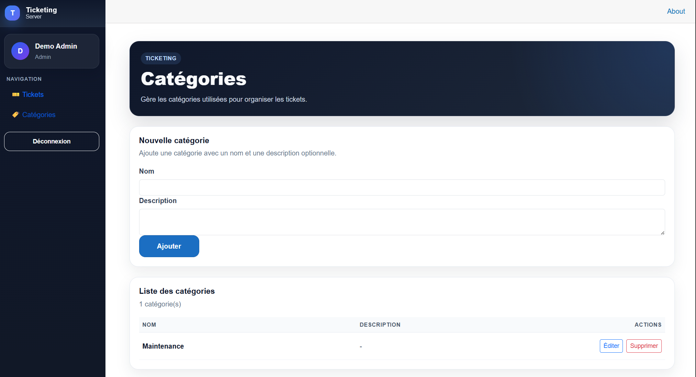

# 🚀 TicketingAI

Modern enterprise Ticket Management System built with **.NET 10**, **Blazor**, **SQL Server** and a complete **AI-powered RAG engine** using **Llama 3.2**, **Nomic Embeddings**, **Qdrant** and **MCP**.

<p align="center">
  
  
  
  
  
  
  
  
  
  
</p>

## Demo

<p align="center">
  
</p>

## 📑 Table of Contents

- Overview
- Why this project?
- Features
- Architecture
- Getting Started
- Screenshots
- AI Features
- Testing
- Logging & Error Handling
- Security
- CI/CD
- Roadmap
- License

Overview

TicketingAI is a modern full-stack ticket management application demonstrating current .NET development practices together with practical Artificial Intelligence integration.

The project combines:

a production-style ticket management application built with ASP.NET Core, Blazor and SQL Server
a JWT authentication system with refresh token rotation
a Clean Architecture implementation
a complete Retrieval-Augmented Generation (RAG) pipeline using Llama 3.2, Nomic Embeddings and Qdrant

Beyond CRUD operations, the repository demonstrates how generative AI can be integrated into a real business application.

# Why this project?

This repository was created to explore modern backend architecture and AI integration in enterprise applications.

It demonstrates:

software architecture
authentication
persistence
testing
semantic search
vector databases
local Large Language Models

## ⭐ Highlights

- ✅ Clean Architecture
- ✅ CQRS
- ✅ JWT Authentication
- ✅ Refresh Token Rotation
- ✅ Blazor Server & WebAssembly
- ✅ SQL Server
- ✅ Entity Framework Core
- ✅ AI Agent
- ✅ RAG
- ✅ MCP
- ✅ Qdrant
- ✅ Embeddings
- ✅ Docker
- ✅ Unit Tests
- ✅ Integration Tests

## ✨ Features

### Authentication & Security
- JWT authentication
- Refresh token rotation
- Role-based authorization
- Secure password hashing

### Ticket Management
- Create, update and delete tickets
- Ticket status workflow
- Categories management
- Comments management

### Modern Architecture
- Clean Architecture
- CQRS pattern
- Dependency Injection
- Repository Pattern

### API
- RESTful API
- Swagger / OpenAPI documentation
- Global exception handling
- ProblemDetails (RFC 7807)

### Database
- SQL Server
- Entity Framework Core
- Database migrations

### Frontend
- Blazor WebAssembly
- Responsive UI
- Authentication state management

### AI Features
- AI Agent
- AI Tools
- Retrieval-Augmented Generation (RAG)
- Semantic Search with Embeddings
- Qdrant Vector Database
- Sample Data Generator

### DevOps
- Docker
- Azure DevOps
- CI/CD Pipeline
- Git

## 🏗️ Architecture

The project follows the principles of Clean Architecture to ensure maintainability, scalability, and testability.

<p align="center">
  
</p>

### Project Structure

```text
src/
│
├── Ticketing.Api
├── Ticketing.Application
├── Ticketing.Domain
├── Ticketing.Infrastructure
├── Ticketing.Shared
│
tests/
│
├── Ticketing.UnitTests
└── Ticketing.IntegrationTests
```

## 🚀 Getting Started

### Prerequisites

Before running the project, make sure you have installed:

- .NET 10 SDK
- SQL Server
- Docker Desktop
- Visual Studio 2022 or JetBrains Rider

### Clone the repository

```bash
git clone https://github.com/YOUR_USERNAME/Ticketing.git
cd Ticketing
```

### Configure the application

Update the `appsettings.json` file with your SQL Server connection string.

Example:

```json
"ConnectionStrings": {
  "DefaultConnection": "Server=.;Database=Ticketing;Trusted_Connection=True;TrustServerCertificate=True;"
}
```

### Apply database migrations

```bash
dotnet ef database update
```

### Run the API

```bash
dotnet run --project src/Ticketing.Api
```

Swagger will be available at:

```
https://localhost:7146/swagger
```

### Run the Blazor application

```bash
dotnet run --project src/Ticketing.Blazor
```

## 📸 Screenshots

### Tickets



### Ticket Details



### Categories




## 🤖 AI Features

Ticketing includes several AI capabilities built with modern LLM technologies.

### AI Agent

The AI Agent can answer questions about tickets by combining:

- Retrieval-Augmented Generation (RAG)
- Semantic Search
- MCP Tools
- Large Language Models

### Sample Data Generator

Generate realistic ticket data using an LLM.

Example use cases:

- Populate development databases
- Create integration test datasets
- Demonstrate application features

### RAG Pipeline

The Retrieval-Augmented Generation pipeline consists of:

1. Document ingestion
2. Text chunking
3. Embedding generation
4. Vector storage in Qdrant
5. Semantic search
6. LLM response generation


                 User Question
                       │
                       ▼
              Generate Embedding
                       │
                       ▼
            Search in Qdrant Vector DB
                       │
                       ▼
           Retrieve Relevant Chunks
                       │
                       ▼
          Build Prompt + Context
                       │
                       ▼
                  Llama 3.2
                       │
                       ▼
                  Final Answer


## MCP Integration

The AI Agent can invoke external tools through the Model Context Protocol.

Implemented tools:

- Get Ticket by Id
- Count Open Tickets
- List Available Tools


```text
                  👤 User
                     │
                     ▼
              🤖 AI Agent (MCP)
                     │
      ┌──────────────┼──────────────┐
      │              │              │
      ▼              ▼              ▼
 Get Ticket      Count Open     List Tools
  by Id Tool     Tickets Tool      Tool
      │              │              │
      └──────────────┼──────────────┘
                     │
                     ▼
               🗄️ SQL Server
```


### AI Stack

- Ollama
- Llama 3
- Nomic Embeddings
- Qdrant
- MCP

## 🧪 Testing

The solution includes both unit and integration tests to ensure code quality and application reliability.

### Unit Tests

- Business rules
- Application services
- Domain validation

### Integration Tests

- REST API endpoints
- Authentication
- Database interactions
- End-to-end workflows

Run all tests:

```bash
dotnet test
```

## 📋 Logging & Error Handling

The application provides production-ready diagnostics through:

- Global Exception Middleware
- RFC 7807 ProblemDetails responses
- Structured logging with Serilog
- Request tracing
- Centralized error handling

## 🔐 Security

Authentication and authorization are implemented using modern security practices.

Features include:

- JWT Authentication
- Refresh Token Rotation
- Role-Based Authorization
- Password Hashing
- Protected API Endpoints
- Claims-based Identity

## ⚙️ CI/CD

The project is designed to be continuously integrated and deployed.

Current DevOps features:

- Azure DevOps
- Git Flow
- Automated Builds
- Docker Support

## 🚀 Roadmap

- ✅ Clean Architecture
- ✅ JWT Authentication
- ✅ Refresh Tokens
- ✅ Blazor Frontend
- ✅ SQL Server Migration
- ✅ Docker Support
- ✅ Unit Tests
- ✅ Integration Tests
- ✅ AI Sample Data Generator
- ✅ RAG Integration
- ✅ Qdrant Vector Database
- ✅ MCP Integration
- ⏳ Streaming AI Responses
- ⏳ Multi-Agent Support
- ⏳ Kubernetes Deployment

## 📄 License

This project is released under the MIT License.

## 👨‍💻 Author

**Ibrahim Zebdi**

Senior .NET Developer

GitHub: https://github.com/brahimusgmail
